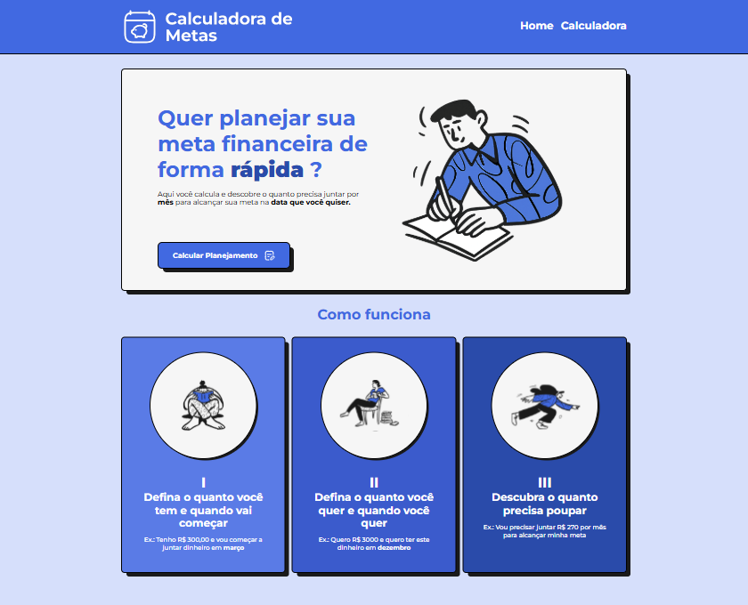
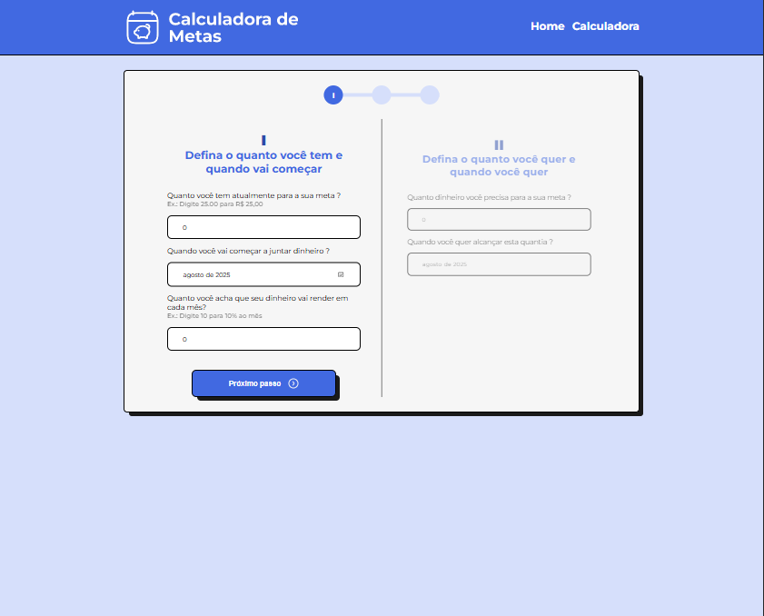
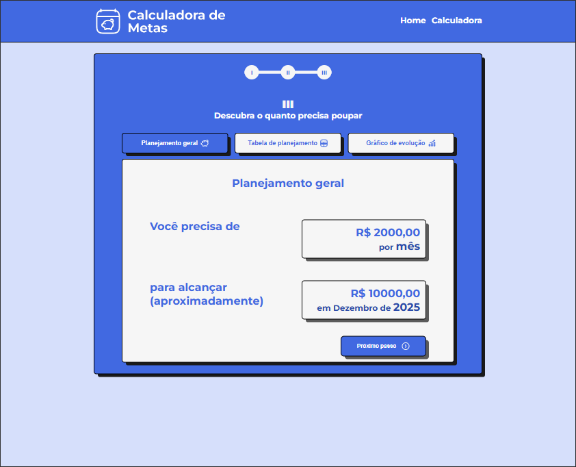
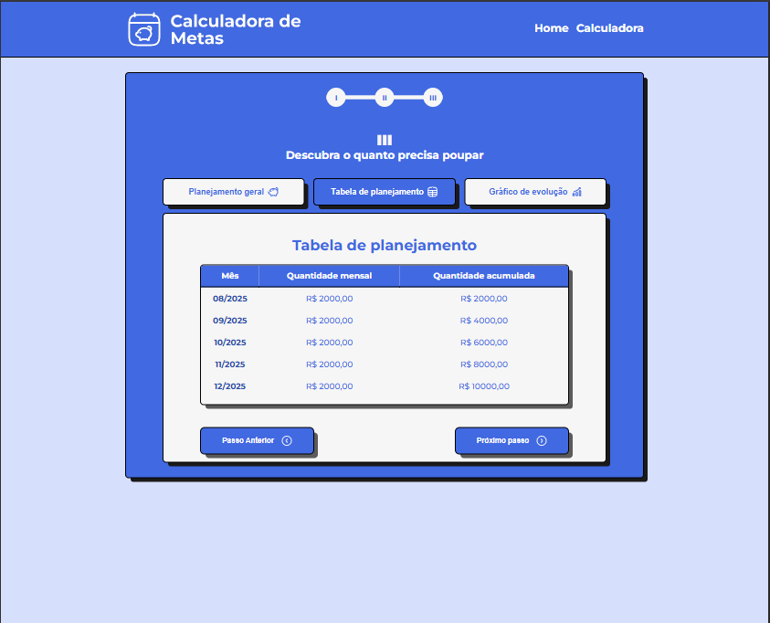
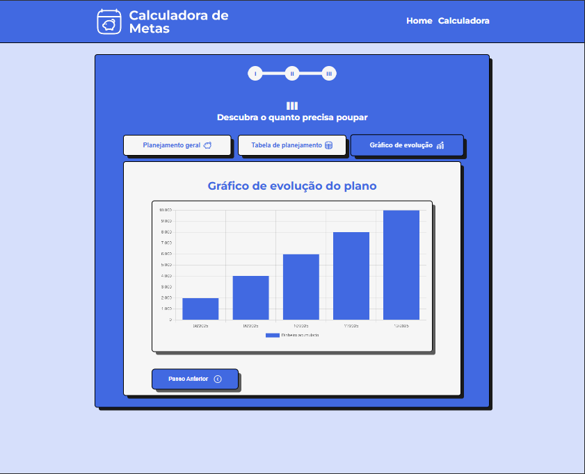

# Calculadora de Metas

Acesse em: bernardos.github.io/calculadora-metas

Um projeto react para organizar, planejar e visualizar uma meta financeira. O site é composto por quatro páginas:

- **Home:** Uma landing page que mostra como funciona o processo para "calcular" a meta;
- **Informações sobre a meta:** Nesta página temos parte do formulário, onde o usuário irá colocar as informações sobre o estado inicial de sua meta e as informações sobre a meta em si, e quando quer alcançá-la.
- **Resultado:** Nesta tela será exibido o cálculo de quanto o usuário precisa acumular por mês para alcançar sua meta e também será possível visualizar uma tabela e um gráfico que demonstra o progresso da meta de acordo com os meses.

------
# Telas do projeto

## Home

## Página de Informações sobre a meta

## Resultado
### Dados da meta

### Tabela de planejamento

### Gráfico de evolução do plano

-----
# Implementação

Este projeto foi implementado utilizando algumas bibliotecas para auxiliar a funcionalidade de cada página, dentro dos formulários foi utilizado o `Formik` e para apresentar os resultados em forma de gráficos foi utilizada a bilioteca `Chart.Js`.

Além disso para compartilhamento de informações entre componentes foi utilizado a `Context API`, e para as rotas a biblioteca `React Router Dom`.

----

Desenvolvido por [BernardoS](https://github.com/BernardoS)