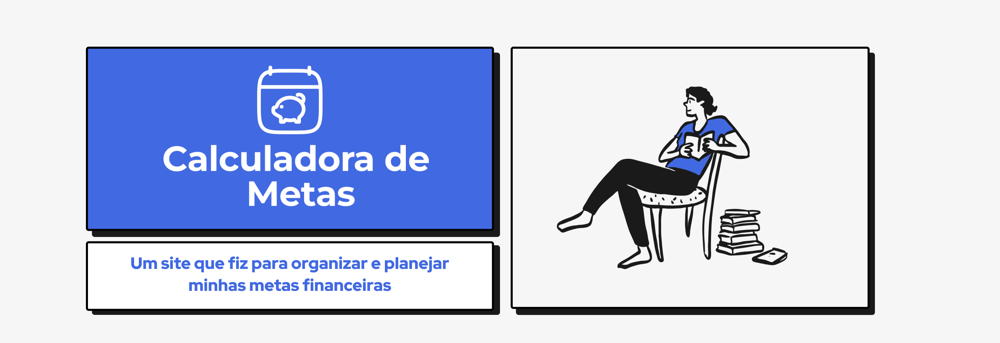

# Calculadora de Metas

Um projeto react para organizar, planejar e visualizar uma meta financeira. O site é composto por quatro páginas:

- **Home:** Uma landing page que mostra como funciona o processo para "calcular" a meta;
- **Informações sobre a meta:** Nesta página temos parte do formulário, onde o usuário irá colocar as informações sobre o estado inicial de sua meta e as informações sobre a meta em si, e quando quer alcançá-la.
- **Resultado:** Nesta tela será exibido o cálculo de quanto o usuário precisa acumular por mês para alcançar sua meta e também será possível visualizar uma tabela e um gráfico que demonstra o progresso da meta de acordo com os meses.

------

# Implementação

No momento a aplicação ainda está em construção, portanto posteriormente serão inseridos nesta seção os detalhes de implementação do projeto.